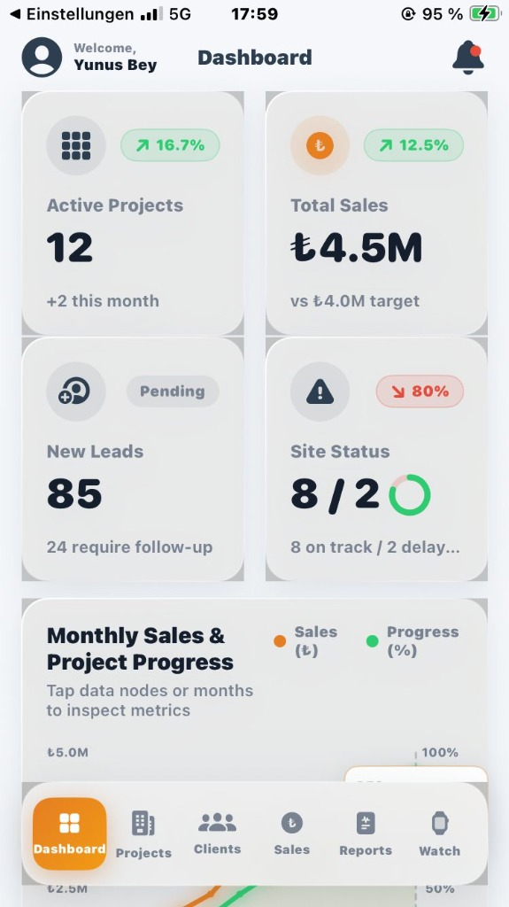
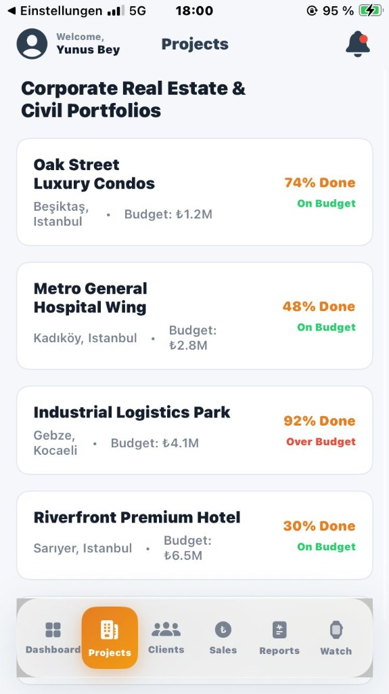
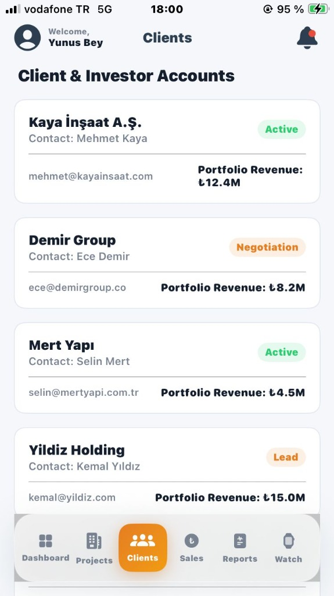

# Palet CRM

Palet CRM is a high-performance, native SwiftUI client relationship management and project tracking dashboard designed specifically for construction company executives. The application provides unified visibility across active construction sites, financial performance, client pipelines, and key metrics.

The user interface automatically adapts to specific size classes and platform constraints, delivering targeted layouts for iPhone (compact bottom floating tabs), iPad (master-detail navigation split views), and macOS (three-column catalog listings with custom toolbars).

## App Screenshots

Below are the screenshots of the application running natively:

### Dashboard & Metrics
Overview of executive metrics including active projects, sales performance, leads, and site status:

### Critical Projects & Client Accounts
Breakdown of active construction statuses and client accounts data:

| Critical Project Status | Client Accounts |
|---|---|
|  |  |

### Projects Portfolio
Detailed view of corporate real estate and civil portfolios:

---

## Technical Architecture

The codebase is organized into modular files focusing on separation of concerns, native performance, and cross-platform compatibility:

### 1. Visual Token System (Theme.swift)
- **Design Tokens**: Houses the primary brand color palette consisting of Deep Slate Blue (`#2C3E50`), Brushed Copper (`#E67E22`), and semantic state indicators (Soft Green for positive trends, Soft Red for critical alerts, Amber for warnings).
- **Glassmorphic backing modifier**: Implements a custom `.glassCardStyle()` view modifier. It overlays frosted material blurs (`.ultraThinMaterial` on iOS/iPadOS and host HUD NSVisualEffectViews on macOS) with a multi-stop white-gradient stroke to catch border highlights.
- **Hardware-Accelerated Press-Lift modifier**: Implements a `.luxury3DTilt()` modifier that animates cards on tap or long press using scale and shadow differentials (`.scaleEffect(0.97)` and expanded shadow blur radius) with locked frame rate performance.

### 2. Mock Data Controller (Models.swift)
- **Data Structs**: Defines strictly typed data models for `KPICardData`, `Project` (with budget status enumerations), `SalesProgressDataPoint`, `FunnelStage`, and `Client`.
- **MockData Controller**: Hosts comprehensive sample records matching Turkish Lira (₺) currency metrics, construction site milestones, and active pipeline conversion lists.

### 3. Native Visualizations (Components.swift)
- **KPICardView**: Interactive glassmorphic widgets featuring spring scale feedback and integrated status dial previews.
- **SiteStatusDonutChart**: A donut graphic. Tapping on a slice (On Track vs. Delayed) triggers a trigonometric offset calculation (sine/cosine matching segment mid-angles) that translates and scales the sector outward from the circle using spring physics.
- **DualAxisChart**: A custom path-based chart plotting Monthly Sales (copper) and progress (green) with gridlines, left/right dual-axes, and blurred glowing under-line trails. It maps invisible button targets over coordinate nodes to prevent gesture scroll locking.
- **SalesFunnelChartView**: Integrates cascading glass chevrons detailing leads volume and conversion rates.
- **CriticalProjectsListView**: Modern progress lists detailing project status, budgets, managers, and deadlines.

### 4. Watch Complications Simulator (WatchComplicationsView.swift)
- **Watch Simulator**: Features a mock Space Gray Apple Watch chassis containing active modular text and circular dials.
- **Interactive Details**: Clicking complications on the watch screen updates corresponding metric descriptions below the watch body.

### 5. Responsive Shell (ContentView.swift)
- **iOS Layouts**: Renders a floating bottom tab bar on iPhone and a collapsible NavigationSplitView on iPad.
- **macOS Layout**: Displays a full three-column view (Sidebar -> Content List -> Main Canvas) with custom window toolbars.
- **Transitions**: Employs hardware-accelerated opacity page transitions for seamless page swapping.
